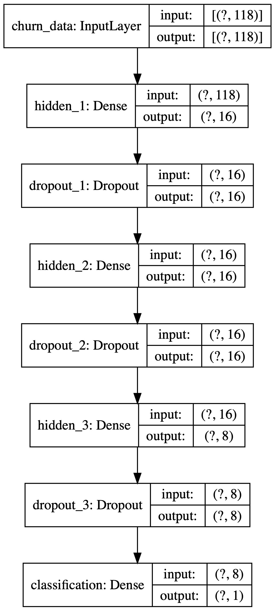
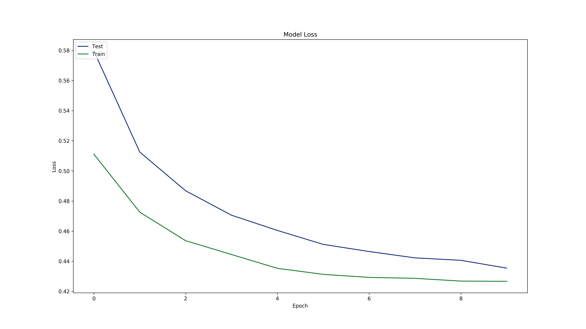

```{r setup, include=FALSE}
library(reticulate)
knitr::opts_chunk$set(echo = TRUE)
use_python('/Users/Chris/.pyenv/shims/python3')
```

# Customer Churn

## Why did we remove "customerID"?
*customerID* column is a unique classifier that the neural network might use to perfectly fit the training data without using any other column, if the model has enough capacity. It needs to be removed for the model to actually generalise patterns with all information available.

## Handle missing values

### Why and how deleting observations with null values affect the model
Deleting observations with null values removes all information about these observations from the model. The benefit is not to have to deal with missing values but the cost is to suffer from potential information loss with fewer observations. Another risk is to biase the model because the cause of missing data is systematic other than random.

### Explore different techniques of handling missing values
Missing values, in the case of some K-nearest neighbours and tree-based models, don't have to be handled at all because these methods are robust to missing values.  
In case of otherwise, generally missing values are either deleted or imputed depending on circumstances. When data is big enough and the cause of missing data is random, we can delete missing data without biasing the model.  
Imputation is available when data is small or the cause of missing data is unknown. A few different ways of imputing data exist. We can simply replace missing values with a summary statistic (i.e. mean, mode or median) from their columns. Alternatively, we can draw random values from other non-missing values in the same column as the missing data as proxies for the missing data. Additionally, missing data can be replaced by output from another predictive algorithms.  

### Implement one of these techniques and determine if it has an effect on the overall accuracy of your model
After imputing missing values in 'TotalCharges' with its mean, the test accuracy seems to have improved, however, this is because the mean includes information about test data. The test accuracy is falsely inflated.

## Why did we log transform the 'TotalCharges' variable?
We log transform the variable to put it into a smaller scale.

## Why did we normalise the data?
The data is centered and scaled for faster computations. Otherwise the model has to estimate a different distribution for every layer as the input data change.

## What should we use for multiclass classification problem?
For problems where the label has multiple levels, we should use categorical crossentropy loss function.

## Perform hyperparameter tuning to better understand the performance of your model
*Present the architecture and parameters of your best possible model*  

The overall architecture consists of three dense layers and three dropout layers as well as one final dense layer with one sigmoid computational unit to estimate probability.  
The hyperparameters are 20% dropout rate, 64 batch size and 10 epochs.  
*Does your model suffer from underfitting or overfitting? Discuss using plots.*  

Neither. Both training loss and testing loss dropped to a low level. The complexity and the regularisation effort paid off.  
*Inspect the performance with all the metrics used in class.*  
Accuracy on test data is around 78% as calculated by the code below.  
ROC-AUC score is about 82%.  

## Check the performance with other classifiers you know
Logistic regression achieves a higher classification accuracy than the neural network. This suggests limited complexity of the relationship within the data which requires only simpler methods such as logistic regression.
```{python}
from __future__ import absolute_import, division, print_function, unicode_literals

# Import libraries
import numpy as np
import pandas as pd
from tensorflow import keras
from tensorflow.keras import layers
from tensorflow.keras.utils import plot_model
import matplotlib.pyplot as plt
import os
from sklearn.model_selection import train_test_split
from sklearn.preprocessing import scale
from sklearn.metrics import roc_auc_score, precision_recall_fscore_support
from sklearn.linear_model import LogisticRegression

# Configure the programme
plt.style.use('seaborn-dark-palette')

# Specify global parameters
input_path = 'Customer Churn with ANN/'
input_file = 'Telco-Customer-Churn.csv'
output_path = '/output/'
output_file = 'output.csv'
categorical_columns = ['gender', 'seniorcitizen', 'partner', 'dependents', 'tenure', 'phoneservice', 'multiplelines', 'internetservice', 'onlinesecurity', 'onlinebackup', 'deviceprotection', 'techsupport', 'streamingtv', 'streamingmovies', 'contract', 'paperlessbilling', 'paymentmethod', 'churn']
```

```{python}
class Solver:
	'''Executes sub-modules through this class object'''	
	def __init__(self, input_path, input_file, output_path, output_file, impute_nan = False, test_size = 0.2, dropout_rate = 0.2):
		'''Loads global variables into the object'''
		Aux.directory_create(input_path + output_path[1:-1])
		self.input_path = input_path
		self.input_file = input_file
		self.output_path = output_path
		self.output_file = output_file
		self.impute_nan = impute_nan
		self.test_size = test_size
		self.dropout_rate = dropout_rate
		self.df = pd.read_csv(self.input_path + self.input_file)
		self.X_train = pd.DataFrame()
		self.X_test = pd.DataFrame()
		self.y_train = pd.DataFrame()
		self.y_test = pd.DataFrame()
		self.model = None
		self.predicted = pd.Series()

	def data_clean(self):
		'''Cleans the data'''
		self.df = Aux.column_names_clean(self.df)
		self.df.drop(['customerid'], axis = 1, inplace = True)
		self.df['totalcharges'].replace(' ', np.nan, inplace = True)
		self.df['totalcharges'] = self.df['totalcharges'].astype(float)
		if self.impute_nan:
			self.df['totalcharges'].fillna(self.df['totalcharges'].mean(), inplace = True)
		else:
			self.df.dropna(subset = ['totalcharges'], inplace = True)
		self.df[categorical_columns] = self.df[categorical_columns].astype('category')
		self.df['totalcharges'] = self.df['totalcharges'].astype(float)
		self.df['totalcharges'] = np.log(self.df['totalcharges'])
		self.df = pd.concat([pd.get_dummies(self.df.drop('churn', axis = 1)), self.df['churn']], axis = 1)
		self.df['churn'].replace({'Yes': 1, 'No': 0}, inplace = True)
		self.df = Aux.column_names_clean(self.df)
		self.X_train, self.X_test, self.y_train, self.y_test = Aux.data_partition(self.df.drop('churn', axis = 1), self.df['churn'], test_size = self.test_size)
		self.X_train, self.X_test = pd.DataFrame(scale(self.X_train), columns = self.df.columns[:-1]), pd.DataFrame(scale(self.X_test), columns = self.df.columns[:-1])

	def model_define(self):
		'''Defines the architecture for churn rate prediction with a neural network model'''
		inputs = keras.Input(shape = (self.df.shape[1] - 1,), name = 'churn_data')
		x = layers.Dense(16, activation = 'relu', name = 'hidden_1')(inputs)
		x = layers.Dropout(rate = self.dropout_rate, name = 'dropout_1')(x)
		x = layers.Dense(16, activation = 'relu', name = 'hidden_2')(x)
		x = layers.Dropout(rate = self.dropout_rate, name = 'dropout_2')(x)
		x = layers.Dense(8, activation = 'relu', name = 'hidden_3')(x)
		x = layers.Dropout(rate = self.dropout_rate, name = 'dropout_3')(x)
		outputs = layers.Dense(1, activation = 'sigmoid', name = 'classification')(x)
		self.model = keras.Model(inputs = inputs, outputs = outputs, name = 'customer_churn_model')
		self.model.summary()
		plot_model(self.model, to_file = self.input_path + self.output_path + 'computational_graph.png', show_shapes = True, dpi = 300)

	def model_train(self):
		'''Trains the model with historical churn data'''
		self.model.compile(loss = keras.losses.BinaryCrossentropy(),
			      optimizer = keras.optimizers.Adam(),
			      metrics = ['accuracy'])
		history = self.model.fit(self.X_train, self.y_train,
				    batch_size = 64,
				    epochs = 10,
				    validation_split = 0.2)
		Aux.train_history_vis(history.history, path = self.input_path + self.output_path)

	def model_predict(self):
		'''Predicts values with new data given a previously trained model'''
		self.predicted = self.model.predict(self.X_test)
	
	def model_evaluate(self):
		'''Evaluates model based on test data'''
		# Accuracy measure
		test_scores = self.model.evaluate(self.X_test, self.y_test, verbose = 2)
		self.model.save(self.input_path + self.output_path + 'model')
		print('Test loss:', test_scores[0])
		print('Test accuracy:', test_scores[1])		

		# AUC measure
		roc_auc = roc_auc_score(self.y_test, self.predicted)
		print('AUC score:', roc_auc)

		# Precision, recall and F1 measures
		predicted_class = np.where(self.predicted <= 0.5, 0, 1)
		p_r_f1 = precision_recall_fscore_support(self.y_test, predicted_class)
		print(p_r_f1)

	def exec(self):
		self.data_clean()
		self.model_define()
		self.model_train()
		self.model_predict()
		self.model_evaluate()
```

```{python}
class Logit:
	'''An alternative classifier to neural networks'''
	def logit(X_train, y_train, X_test, y_test):
		'''Runs logistic regression on train data'''
		logit_obj  = LogisticRegression(random_state = 42).fit(X_train, y_train)
		pred_class = logit_obj.predict(X_test)
		print('The accuracy of classification by logistic regression is ' + str(logit_obj.score(X_test, y_test)))
```

```{python}
class Aux:
	'''Supports the main solver module'''
	def column_names_clean(df):
		'''Cleans column names'''
		df.columns = df.columns.str.strip().str.lower().str.replace(' ', '_').str.replace('(', '').str.replace(')', '')
		return df

	def directory_create(path):
		'''Creates a directory if not already exists'''
		if not os.path.exists(path):
			os.makedirs(path)	

	def data_partition(X, y, test_size):
		'''Splits data into training and testing sets'''
		X_train, X_test, y_train, y_test = train_test_split(X, y, test_size = test_size, random_state = 42)
		return X_train, X_test, y_train, y_test

	def train_history_vis(history, path):
		'''Visualises the model's training history in terms of loss and accuracy'''
		# Plot training & validation accuracy values
		plt.figure(figsize = (16,9))
		plt.plot(history['accuracy'])
		plt.plot(history['val_accuracy'])
		plt.title('Model Accuracy')
		plt.ylabel('Accuracy')
		plt.xlabel('Epoch')
		plt.legend(['Train', 'Test'], loc = 'upper left')
		plt.savefig(path + 'Accuracy_History.png', dpi = 300)
		plt.close()

		# Plot training & validation loss values
		plt.figure(figsize = (16,9))
		plt.plot(history['loss'])
		plt.plot(history['val_loss'])
		plt.title('Model Loss')
		plt.ylabel('Loss')
		plt.xlabel('Epoch')
		plt.legend(['Test', 'Train'], loc = 'upper left')
		plt.savefig(path + 'Loss_History.png', dpi = 300)
		plt.close()

```

```{python}
solver_object = Solver(input_path, input_file, output_path, output_file, impute_nan = True)
solver_object.exec()
```

```{python}
solver_object = Solver(input_path, input_file, output_path, output_file)
solver_object.exec()
```

```{python}
Logit.logit(solver_object.X_train, solver_object.y_train, solver_object.X_test, solver_object.y_test)
```

# GE Stock Price Prediction Case

## Use any combination (at least three) of features to predict closing value of the upcoming day
The performance did improve after adding more features as demonstrated in the code. The test loss went down after adding more features.

## Use RNN with one or any combinations of features to predict the closing value of one upcoming day. Did the performance increase after adding more features?
The performance also improved after adding more features.

## Perform hyperparameter tuning to improve the performance of your LSTM model
I increased the number of timesteps (previous days) and added another LSTM layer with 32 units before the linear Dense layer in the end.

## Perform hyperparameter tuning to improve the performance of your RNN model

## Predict the closing values for 2 upcoming days using feature values from 8 previous days

## Discuss in half A4 page the limitations of deep learning on predicting stock market
Although neural network is powerful at approximating the statistical relationshiop between historical financial data and future financial data, usually future stock prices are correlated with non-financial factors that are not included in the dataset.
Another issue is the availibility of data. Predicting daily stock prices is much easier than predicting monthly or annual stock prices because there is much less monthly and yearly financial data.

```{python}
from __future__ import absolute_import, division, print_function

# Import libraries
import numpy as np
import pandas as pd
import tensorflow as tf
from tensorflow import keras
from tensorflow.keras.models import Sequential
from tensorflow.keras.layers import LSTM, Dense, BatchNormalization
from tensorflow.keras.utils import plot_model
from tensorflow.keras.callbacks import EarlyStopping
from sklearn.preprocessing import StandardScaler
import matplotlib.pyplot as plt
import os

# Specify global parameters
input_path = 'GE Stock Price with LSTM/'
input_file = 'ge.us.txt'
output_path = '/output/'
output_file = 'output.csv'
features = ['open', 'volume', 'close']
time_col_name = 'day'
n_steps = 4
batch_size = 10
```

```{python}
class Solver:
	'''Executes sub-modules through this class object'''	
	def __init__(self, input_path, input_file, output_path, output_file, features, time_col_name, n_steps, batch_size, train_test_split = 0.85):
		'''Loads global variables into the object'''
		Aux.directory_create(input_path + output_path[1:-1])
		self.input_path = input_path
		self.input_file = input_file
		self.output_path = output_path
		self.output_file = output_file
		self.features = features
		self.time_col_name = time_col_name
		self.train_test_split = train_test_split
		self.n_steps = n_steps
		self.batch_size = batch_size
		self.n_features = len(self.features)
		self.df = Aux.data_import(self.input_path + self.input_file)
		self.train = pd.DataFrame()
		self.val = pd.DataFrame()
		self.test = pd.DataFrame()
		self.X_train = pd.DataFrame()
		self.y_train = pd.DataFrame()
		self.X_val = pd.DataFrame()
		self.y_val = pd.DataFrame()
		self.X_test = pd.DataFrame()
		self.y_test = pd.DataFrame()
		self.model1 = None
		self.model2 = None
		self.model3 = None
		self.scaler = None
		self.predictions = None
		self.test_scroes = None

	def diagnostics(self):
		'''Displays basic configuration info'''
		Aux.diagnostics()

	def data_clean(self):
		'''Cleans the data'''
		self.df = Aux.column_names_clean(self.df)
		self.df[self.time_col_name] = pd.to_datetime(self.df[self.time_col_name])
		#self.df.set_index(time_col_name, inplace = True)
		self.df['close'] = np.sqrt(self.df['close'])
		self.df = Aux.column_reorder(self.df)
		self.df = self.df[self.features]

	def data_vis(self):
		'''Create visualisations of raw data'''
		plt.figure(figsize = (6,6))
		self.df['close'].plot()
		plt.savefig(self.input_path + self.output_path + 'plot_1.png', dpi = 300)
		plt.close()

	def data_split(self):
		'''Splits data into train and test sets without shuffling'''
		self.train, self.test = np.split(self.df, [int(self.train_test_split * len(self.df))])
		self.train, self.val = np.split(self.train, [int(self.train_test_split * len(self.train))])
		self.scaler = StandardScaler()
		self.train, self.val, self.test = self.scaler.fit_transform(self.train), self.scaler.fit_transform(self.val), self.scaler.fit_transform(self.test)
		self.X_train, self.y_train = Aux.data_reshape(self.train, self.n_steps)
		self.X_val, self.y_val = Aux.data_reshape(self.val, self.n_steps)
		self.X_test, self.y_test = Aux.data_reshape(self.test, self.n_steps)

	def model_define(self):
		'''Defines the model architecture'''
		self.model1 = Sequential()
		self.model1.add(BatchNormalization(input_shape = (self.n_steps, self.n_features)))
		self.model1.add(LSTM(64, activation = 'relu'))
		self.model1.add(Dense(1))
		self.model1.summary()
		plot_model(self.model1, self.input_path + self.output_path + 'model.png', show_shapes = True)
		self.model1.save(self.input_path + self.output_path + 'model')
		self.model1.compile(loss = keras.losses.logcosh,
				    optimizer = keras.optimizers.Adam(),
				    metrics = ['mse'])

	def model_train(self):
		'''Trains the model with historical data'''
		history = self.model1.fit(self.X_train, self.y_train,
					 batch_size = self.batch_size,
					 epochs = 100,
					 validation_data = (self.X_val, self.y_val),
					 callbacks = Aux.earlystopping())
		Aux.train_history_vis(history.history, path = self.input_path + self.output_path)
	
	def model_eval(self):
		'''Evaluates model performance on test data'''
		self.predictions = self.model1.predict(self.X_test)
		self.test_scores = self.model1.evaluate(self.X_test, self.y_test, verbose = 2)
		print('Test loss:', self.test_scores[0])

	def exec(self):
		self.diagnostics()
		self.data_clean()
		self.data_vis()
		self.data_split()
		self.model_define()
		self.model_train()
		self.model_eval()
		print('Training Data:')
		print(self.scaler.inverse_transform(self.train))
		print('Testing Data:')
		print(self.scaler.inverse_transform(self.test))
```

```{python}
class Aux:
	'''Supports the main solver module'''
	def data_import(path):
		'''Imports data'''
		df = pd.read_csv(path, sep = ',')
		return df

	def column_names_clean(df):
		'''Cleans column names'''
		df.columns = df.columns.str.strip().str.lower().str.replace(' ', '_').str.replace('(', '').str.replace(')', '')
		return df

	def directory_create(path):
		'''Create a directory if not already exists'''
		if not os.path.exists(path):
			os.makedirs(path)

	def diagnostics():
		print('*'*10 + 'Tensorflow Version' + '*'*10)
		print('*'*10 + tf.__version__ + '*'*10)

	def earlystopping():
		'''Returns a Keras earlystopping object'''
		return [EarlyStopping(monitor = 'mse', patience = 10)]

	def column_reorder(df):
		'''Reorder dataframe columns so the target feature is at the end'''
		column_labels = df.columns.values.tolist()
		target_label = column_labels.pop(-3)
		column_labels.append(target_label)
		return df[column_labels]

	def data_reshape(df, n_steps):
		'''Splits multiple parallel time-series into three-dimensional samples for LSTM'''
		X, y = list(), list()
		for i in range(len(df)):
			# Find the end of this sample
			end_ix = i + n_steps
			# Check if we have gone beyond the data
			if end_ix >= len(df):
				break
			# Gather input and output parts of the sample
			seg_x, seg_y = df[i:end_ix, :], df[end_ix, -2]
			X.append(seg_x)
			y.append(seg_y)
		return np.array(X), np.array(y)

	def train_history_vis(history, path):
		'''Visualises the model's training history in terms of loss and accuracy'''
		# Plot training & validation loss values
		plt.figure(figsize = (16,9))
		plt.plot(history['loss'])
		plt.plot(history['val_loss'])
		plt.title('Model Loss')
		plt.ylabel('Loss')
		plt.xlabel('Epoch')
		plt.legend(['Test', 'Train'], loc = 'upper left')
		plt.savefig(path + 'Loss_History.png', dpi = 300)
		plt.close()
```

```{python}
solver_object = Solver(input_path, input_file, output_path, output_file, features, time_col_name, n_steps, batch_size)
solver_object.exec()
```